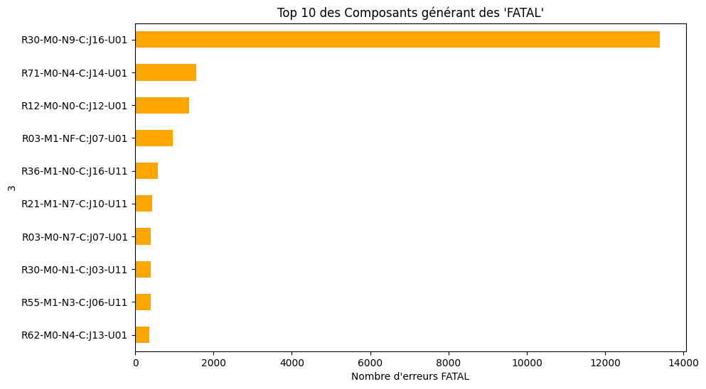
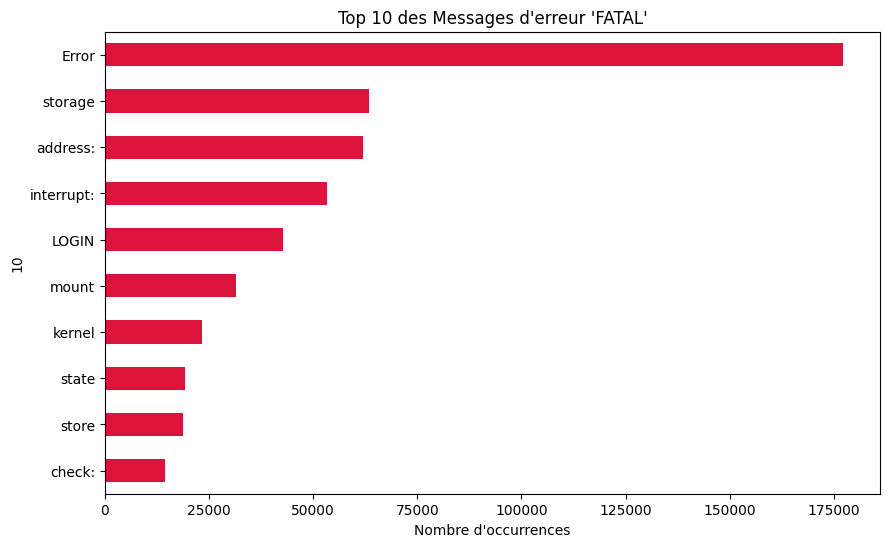

# Analyseur de Logs "Big Data" (4.7M lignes) en Python/Pandas

## 1. Objectif du Projet

Ce projet démontre ma capacité à analyser un jeu de données "Big Data" (le dataset BGL de 4.7 millions de lignes) qui **ne tient pas en mémoire RAM** sur une machine standard.

L'objectif est d'effectuer un cycle d'analyse complet :

1.  **Analyser** le fichier sans saturer la mémoire pour compter les différents niveaux de criticité.

2.  **Identifier** et **extraire** les erreurs critiques (`FATAL`) pour une analyse ciblée.

3.  **Diagnostiquer** la cause racine (Root Cause Analysis) de ces erreurs critiques.

## 2. Le Défi Technique : La Gestion de la RAM

Le fichier `BGL.log` (plusieurs Go) ne peut être chargé entièrement en mémoire avec Pandas. Tenter de le faire résulterait en un crash dû à la saturation de la RAM.

**Solution :** Le script implémente une lecture **ligne par ligne** du fichier source et un traitement par **"morceaux" (`chunks`)** de 500 000 lignes. Chaque morceau est converti temporairement en DataFrame Pandas, analysé, puis **libéré de la mémoire** avant de passer au morceau suivant. Cette approche permet l'analyse complète sur des machines aux ressources limitées (comme Google Colab ou un PC portable standard).

## 3. Démarche et Résultats

### Étape 1 : Inspection

Une inspection initiale sur un échantillon de 1000 lignes a été réalisée pour comprendre la structure des logs. Cette étape a permis d'identifier :

* La présence de données "sales" en début de fichier (ligne d'index 0).

* Une structure stable à partir de la ligne 1, avec le niveau de criticité (`INFO`, `FATAL`, etc.) situé dans la **colonne 8**.

* Le nom du composant matériel dans la **colonne 3**.

* Le début du message d'erreur dans la **colonne 10**.

### Étape 2 : Analyse (Comptage Global)

L'analyse complète du fichier (4.7M lignes), réalisée par morceaux, a permis de quantifier la répartition des différents niveaux de logs, révélant **707 523 erreurs critiques (FATAL)** parmi les autres niveaux (INFO, ERROR, etc.).

*(Le résultat textuel détaillé de ce comptage est visible dans l'output de la cellule 7 du notebook `Analyseur_de_Logs_Big_Data.ipynb`)*.

### Étape 3 : Extraction (Filtrage des Menaces)

Les **707 523 lignes** contenant le mot-clé `FATAL` ont été extraites avec succès du fichier principal. Elles ont été sauvegardées dans un fichier dédié `FATAL_errors.log`, créant ainsi un jeu de données propre et ciblé pour l'enquête.

### Étape 4 : Analyse de Cause Racine (Enquête sur les FATAL)

L'analyse ciblée du fichier `FATAL_errors.log` (qui tient désormais en mémoire et peut être chargé d'un coup) a permis d'identifier les sources principales des erreurs critiques :

**Graphique Top Composants FATAL :**

*(Ce graphique met en évidence les composants matériels générant le plus grand nombre d'erreurs critiques.)*

**Graphique Top Messages FATAL :**

*(Ce graphique montre les types d'erreurs FATAL les plus fréquents, indiquant les problèmes systèmes récurrents.)*
